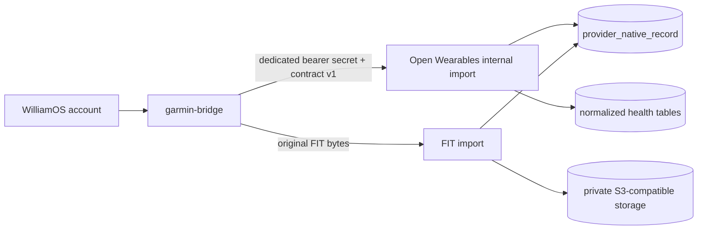

## Scope and responsibilities

This fork treats Garmin as an **import-only provider**. A separately deployed
`garmin-bridge` owns Garmin Connect login, MFA, encrypted session tokens,
polling, cursor state, retries, and rate limiting. Open Wearables never receives
Garmin credentials and never calls Garmin Connect.

Open Wearables owns:

- the private, versioned ingest contract;
- validation, deterministic secret scrubbing, and content hashing;
- scrubbed native observations and normalized health records;
- original FIT activity objects and their manifests;
- provider-data deletion and derived-score recomputation.

Garmin OAuth, webhooks, historical backfill, manual sync, and vendor-workout
routes are unavailable in this fork. Other providers continue to use their
existing integrations.



## Authentication and network controls

Set a different high-entropy secret in the bridge and Open Wearables:

```dotenv config/.env
GARMIN_BRIDGE_INGEST_SECRET=replace-with-at-least-32-random-bytes
GARMIN_BRIDGE_JSON_BODY_MAX_BYTES=2097152
GARMIN_BRIDGE_FIT_BODY_MAX_BYTES=52428800
```

Generate a secret without committing it:

```bash
python3 -c "import secrets; print(secrets.token_urlsafe(48))"
```

Every request must use `Authorization: Bearer <secret>`. The secret is compared
in constant time and is independent of developer API keys. If it is unset, the
routes fail closed with `503`. Keep the routes on a private service network and,
where available, allow inbound traffic only from the bridge workload.

The application does not apply a separate requests-per-minute quota to these
internal routes. The bridge must serialize its Garmin polling, send at most 50
records per JSON batch, retry with bounded exponential backoff, and advance a
cursor only after a successful acknowledgement. A reverse proxy may enforce an
additional service-level request limit.

## JSON import contract

`POST /api/v1/internal/users/{open_wearables_user_id}/imports/garmin`

The authenticated path fixes both the user and provider. Payload fields named
`user_id` or `provider`, unknown fields, unknown kind/method pairs, duplicate
record IDs, naive timestamps, non-finite JSON numbers, and unsupported contract
versions are rejected. Each record is limited to 256 KiB after scrubbing and
canonical serialization.

```bash
curl --fail-with-body \
  --request POST \
  --url "http://open-wearables:8000/api/v1/internal/users/176be8de-8452-4eb7-a7ea-147fec925d9d/imports/garmin" \
  --header "Authorization: Bearer ${GARMIN_BRIDGE_INGEST_SECRET:?missing secret}" \
  --header "Content-Type: application/json" \
  --data '{
    "contract_version": 1,
    "batch_id": "90f4f0e7-c0a4-4de5-8dfc-f0414660764f",
    "kind": "dailies",
    "source_method": "get_stats",
    "records": [
      {
        "provider_record_id": "2026-07-19",
        "source_recorded_at": "2026-07-19T07:00:00Z",
        "source_updated_at": "2026-07-20T02:14:05Z",
        "payload_sha256": "aaaaaaaaaaaaaaaaaaaaaaaaaaaaaaaaaaaaaaaaaaaaaaaaaaaaaaaaaaaaaaaa",
        "canonical": {
          "summaryId": "daily-2026-07-19",
          "calendarDate": "2026-07-19",
          "startTimeInSeconds": 1784444400,
          "startTimeOffsetInSeconds": -25200,
          "steps": 8421,
          "distanceInMeters": 6385,
          "activeKilocalories": 437
        },
        "native": {
          "wellnessStartTimeGmt": "2026-07-19T07:00:00Z"
        }
      }
    ]
  }'
```

Successful response:

```json
{
  "batch_id": "90f4f0e7-c0a4-4de5-8dfc-f0414660764f",
  "committed": 1,
  "inserted": 1,
  "updated": 0,
  "unchanged": 0,
  "rejected": 0,
  "normalization_errors": 0,
  "errors": []
}
```

Native observations are acknowledged even when an upstream schema change
prevents normalization. In that case the response remains `200`,
`normalization_errors` increases, and `errors` contains only the provider record
ID and the stable code `schema_drift`. It never echoes source payloads.

```json
{
  "batch_id": "90f4f0e7-c0a4-4de5-8dfc-f0414660764f",
  "committed": 1,
  "inserted": 1,
  "updated": 0,
  "unchanged": 0,
  "rejected": 0,
  "normalization_errors": 1,
  "errors": [{"provider_record_id": "activity-404", "code": "schema_drift"}]
}
```

### Supported endpoint manifest

The checked-in
[`bridge_manifest_v1.json`](https://github.com/williamos-hq/open-wearables/blob/main/backend/app/services/providers/garmin/bridge_manifest_v1.json)
file is the source of truth. The bridge mirrors that file and both repositories
test their generated requests against it. Open Wearables rejects arbitrary
method names before any write.

| Kind | Source method | Cadence/request policy | Stable key | No-data response |
|---|---|---|---|---|
| `sleeps` | `get_sleep_data` | Daily; one local date | Sleep ID | Empty object |
| `dailies` | `get_stats` | Daily; one local date | Profile date | Empty object |
| `heart_rates` | `get_heart_rates` | Daily; one local date | Profile date | Empty object |
| `hrv` | `get_hrv_data` | Daily; one local date | Profile date | `null` |
| `pulse_ox` | `get_spo2_data` | Daily; one local date | Profile date | Empty object |
| `respiration` | `get_respiration_data` | Daily; one local date | Profile date | Empty object |
| `body_compositions` | `get_body_composition` | Daily; one local date | Timestamp + sequence | Empty list |
| `stress_details` | `get_stress_data` | Daily; one local date | Profile date | Empty object |
| `body_battery` | `get_body_battery` | Daily; one local date | Profile date + sequence | Empty list |
| `blood_pressures` | `get_blood_pressure` | Daily; one local date | Timestamp + sequence | Empty list |
| `skin_temperature` | `get_skin_temperature` | Daily; one local date | Profile date | Empty object |
| `user_metrics` | `get_max_metrics` | Daily; one local date | Profile date | Empty object |
| `fitness_age` | `get_fitnessage_data` | Weekly; one local date | Profile date | Empty object |
| `training_readiness` | `get_training_readiness` | Daily; one local date | Timestamp + sequence | Empty list |
| `training_status` | `get_training_status` | Daily; one local date | Profile date | Empty object |
| `training_load` | `get_training_load_focus` | Daily; one local date | Profile date | Empty object |
| `activities` | `get_activities_by_date` | Seven-day overlap; explicit bounded date range | Activity ID | Empty list |
| `activity_details` | `get_activity` | On change; one activity ID | Activity ID | Not found |
| `activity_laps` | `get_activity_splits` | On change; one activity ID | Activity ID | Empty object |
| `activity_routes` | `get_activity_gps_data` | On change; one activity ID | Activity ID | Empty object |
| `devices` | `get_devices` | Weekly; one bounded list | Device ID | Empty list |

Some kinds are intentionally native-only until their normalized schema is
stable. They are still scrubbed, hashed, stored, and counted.

## Idempotency and corrections

Open Wearables recursively removes credential-like keys from both canonical and
native JSON, serializes the result deterministically, and recomputes SHA-256.
The database identity is `(user, garmin, kind, provider_record_id)`:

- the same scrubbed content is `unchanged` and skips normalization;
- changed content updates the observation and normalized projections;
- corrected activities keep the same Open Wearables event ID while times,
  duration, and details change.

The bridge-supplied hash is contract evidence only; it is never trusted as the
stored hash.

## Original FIT activity import

Enable FIT retention with a private S3-compatible bucket:

```dotenv config/.env
STORE_FIT_FILES=true
RAW_PAYLOAD_S3_BUCKET=open-wearables-private
RAW_PAYLOAD_S3_ENDPOINT_URL=https://s3.example.internal
AWS_ACCESS_KEY_ID=fit-prefix-writer
AWS_SECRET_ACCESS_KEY=replace-in-secret-manager
AWS_REGION=us-west-2
```

The runtime identity needs only list/get/put/delete access to
`fit-files/garmin/*`. Keep public access disabled and do not generate public or
long-lived signed URLs.

An activity JSON record must exist before its FIT asset can be attached:

```bash
curl --fail-with-body \
  --request PUT \
  --url "http://open-wearables:8000/api/v1/internal/users/176be8de-8452-4eb7-a7ea-147fec925d9d/imports/garmin/activities/987654/fit" \
  --header "Authorization: Bearer ${GARMIN_BRIDGE_INGEST_SECRET:?missing secret}" \
  --header "Content-Type: application/vnd.ant.fit" \
  --header "X-Garmin-Contract-Version: 1" \
  --header "X-Garmin-Source-Updated-At: 2026-07-20T02:14:05Z" \
  --data-binary @activity-987654.fit
```

Successful response:

```json
{
  "activity_id": "987654",
  "event_record_id": "231a54af-c4b7-4370-8ca0-8da790a2895a",
  "status": "inserted",
  "object_key": "fit-files/garmin/176be8de-8452-4eb7-a7ea-147fec925d9d/987654/6e92c3f4a4108045d0790bf0dc6dca0bf95c3798682129151ca085df9da2b99b.fit",
  "payload_sha256": "6e92c3f4a4108045d0790bf0dc6dca0bf95c3798682129151ca085df9da2b99b",
  "byte_count": 48217,
  "decode_status": "decoded",
  "decoded_messages": 1854
}
```

Open Wearables checks the 50 MiB limit and FIT header before upload. It stores content-addressed bytes
with `application/vnd.ant.fit` and server-side AES-256 encryption. The parser
counts at most 500,000 decoded messages, inventories fields, and extracts up to
1,000 compact records of each supported metadata kind without allocating
per-second database samples. Omitted compact-record counts are retained in the
manifest. Parser or CRC
failure retains the source object and writes a failure manifest for later
reprocessing.

## Status codes and retry behavior

| Status | Meaning | Bridge action |
|---|---|---|
| `200` | Transaction committed; inspect counts and normalization errors | Advance acknowledged cursor |
| `400` | Invalid `Content-Length` | Fix request; do not retry unchanged input |
| `401` | Missing or incorrect bridge bearer secret | Stop and repair secret configuration |
| `404` | The Garmin activity required by a FIT upload does not exist | Import the activity summary first |
| `413` | JSON, native record, or FIT asset exceeds its bound | Reduce batch/record; do not blindly retry |
| `415` | Incorrect `Content-Type` | Send JSON or `application/vnd.ant.fit` as required |
| `422` | Invalid schema, timestamp, contract version, kind/method pair, or FIT header | Fix the contract; do not retry unchanged input |
| `503` | Ingest secret or FIT storage is unavailable | Retry with bounded exponential backoff |

All successful responses include `Cache-Control: no-store`.

## Deletion, retention, and recovery

`DELETE /api/v1/internal/users/{open_wearables_user_id}/imports/garmin` removes
the user's Garmin native observations, normalized records, health scores,
credentialless connection rows, and every FIT object under that user's prefix.
It then recomputes affected internal sleep scores from the remaining providers.
Object deletion must succeed before the database transaction commits, so a
failed deletion is retry-safe.
Deleting an already absent user or already purged Garmin dataset succeeds with
zero deletion counts, so bridge retries are safe.

```bash
curl --fail-with-body \
  --request DELETE \
  --url "http://open-wearables:8000/api/v1/internal/users/176be8de-8452-4eb7-a7ea-147fec925d9d/imports/garmin" \
  --header "Authorization: Bearer ${GARMIN_BRIDGE_INGEST_SECRET:?missing secret}"
```

```json
{
  "user_id": "176be8de-8452-4eb7-a7ea-147fec925d9d",
  "provider": "garmin",
  "native_records_deleted": 32,
  "data_sources_deleted": 1,
  "health_scores_deleted": 4,
  "connections_deleted": 0,
  "fit_objects_deleted": 3
}
```

Back up PostgreSQL, the application encryption key, and the FIT bucket according
to the deployment's recovery objectives. Test both restore and provider purge.
Deploy compatible bridge and Open Wearables image versions together; contract
version `1` is the compatibility boundary. Rotate the bridge secret by updating
both services during a controlled deployment, and never place it in browser
configuration, logs, source control, or bridge job payloads.
